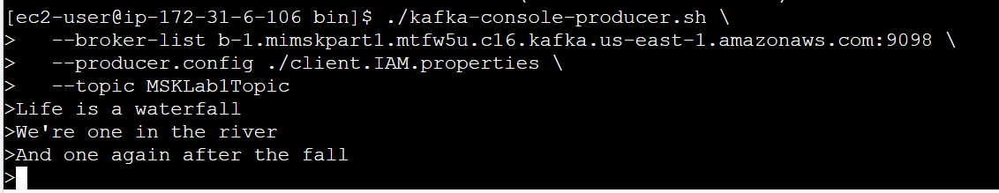

# Create MSK Cluster

Create a yaml file named Homework1.yaml to build MSK cluster and EC2 instance

# Install Java on the client by using the following:

sudo yum -y install java-11

# Running the following command to download Apache Kafka:
wget https://archive.apache.org/dist/kafka/3.5.1/kafka_2.13-3.5.1.tgz
tar -xzf kafka_2.13-3.5.1.tgz

# Go to the kafka directory
cd kafka_2.13-3.5.1/libs

# Run the command to download the Amazon MSK IAM JAR file
wget -O /home/ec2-user/kafka_2.13-3.5.1/libs/aws-msk-iam-auth-1.1.1-all.jar \
            https://github.com/aws/aws-msk-iam-auth/releases/download/v1.1.1/aws-msk-iam-auth-1.1.1-all.jar

# Go to the kafka bin directory
cd ../bin

# Create a new file
vi client.IAM.properties

# IAM
security.protocol=SASL_SSL
sasl.mechanism=AWS_MSK_IAM
sasl.jaas.config=software.amazon.msk.auth.iam.IAMLoginModule required;
sasl.client.callback.handler.class=software.amazon.msk.auth.iam.IAMClientCallbackHandler

# Run the following command to create a topic:
./kafka-topics.sh \
>   --create \
>   --bootstrap-server b-1.mimskpart1.mtfw5u.c16.kafka.us-east-1.amazonaws.com:9098 \
>   --command-config ./client.IAM.properties \
>   --replication-factor 2 \
>   --partitions 1 \
>   --topic MSKLab1Topic

# Run the command to start a console producer
./kafka-console-producer.sh \
  --broker-list b-1.mimskpart1.mtfw5u.c16.kafka.us-east-1.amazonaws.com:9098 \
  --producer.config ./client.IAM.properties \
  --topic MSKLab1Topic

# Open a new EC2 instance connection window, then create a console consumer
./kafka_2.13-3.5.1/bin/kafka-console-consumer.sh \
  --bootstrap-server b-1.mimskpart1.mtfw5u.c16.kafka.us-east-1.amazonaws.com:9098 \
  --consumer.config ./kafka_2.13-3.5.1/bin/client.IAM.properties \
  --topic MSKLab1Topic \
  --from-beginning

# Screen shot indicating it is running successfully:
Producer:

Consumer:

# Try SCRAM

1. Create a KMS key pair using AWS console

2. Create a secret manager key using the previous generate KMS key pair

3. After creating the secret manager key, connecting the secret manager and the MSK cluster using:

   aws kafka batch-associate-scram-secret \
     --cluster-arn arn:aws:kafka:us-east-1:933822101078:cluster/MI-MSK-PART1/6949af83-7099-4ac3-9b44-f0e84fc2f727-16 <cluster-arn> \
     --secret-arn-list arn:aws:secretsmanager:us-east-1:933822101078

   :secret:AmazonMSK_SCRAM_mi-scram-FeDA79 <secret manager arn>

4. Open the generated EC2 instance, create a topic named: client.SCRAM.properties

   **The code to create the property:**

   security.protocol=SASL_SSL
   sasl.mechanism=SCRAM-SHA-512
   sasl.jaas.config=org.apache.kafka.common.security.scram.ScramLoginModule required \\
   username=\"mi-SCRAM\" password=\"mi123456789\";

   **The code to** **create the topic:**

   /home/ec2-user/kafka_2.13-3.5.1/bin/kafka-topics.sh \
     --create \
     --bootstrap-server b-1.mimskpart1.0xesnt.c16.kafka.us-east-1.amazonaws.com:9096 \
     --command-config /home/ec2-user/client.SCRAM.properties \
     --replication-factor 2 \
     --partitions 1 \
     --topic MSKSCRAMTopic

5. Connect between the producer and consumer

   **The code to start the producer:**

   /home/ec2-user/kafka_2.13-3.5.1/bin/kafka-console-producer.sh \
     --broker-list b-1.mimskpart1.0xesnt.c16.kafka.us-east-1.amazonaws.com:9096 \
     --producer.config /home/ec2-user/client.SCRAM.properties \
     --topic MSKSCRAMTopic

   **The code to start the consumer:**

   /home/ec2-user/kafka_2.13-3.5.1/bin/kafka-console-consumer.sh \
     --bootstrap-server b-1.mimskpart1.0xesnt.c16.kafka.us-east-1.amazonaws.com:9096 \
     --consumer.config /home/ec2-user/client.SCRAM.properties \
     --topic MSKSCRAMTopic \
     --from-beginning

6. Send messages from the producer to see if the consumer can receive the messages.

   Producer：

   

   

   Consumer:

   

   

# Try Unauthenticated

# Run the command to start the producer

./kafka_2.13-3.5.1/bin/kafka-console-producer.sh   --bootstrap-server b-1.mimskpart1.0xesnt.c16.kafka.us-east-1.amazonaws.com:9092   --topic MSKTopicUnuthenticated

# Run the command to start the consumer

Open another EC2 instance and run the following command:

./kafka_2.13-3.5.1/bin/kafka-console-consumer.sh   --bootstrap-server b-1.mimskpart1.0xesnt.c16.kafka.us-east-1.amazonaws.com:9092   --topic MSKTopicUnauthenticated

# Screen shot indicating it is running successfully:

Producer:

Consumer:

# Delete all the resources

