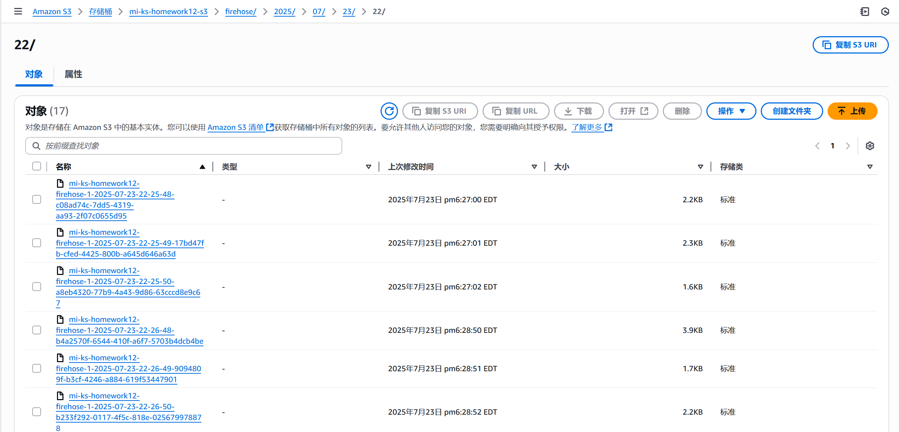

# Amazon Kinesis Homework

This homework aims to demonstrates a real-time AWS kinesis data streaming pipeline, including Kinesis Data Stream, Kinesis Firehose, Lambda function, and S3 bucket for storage. The data used in this project is simulated by Python faker, which are streamed, transformed and store in S3 bucket.


## Table of Contents

1. Project Overview

2. Architecture

3. Prerequisites

4. Deployment Steps

   4.1 Running the Data Producer

   4.2 Data Flow & Transformation

   4.3 IAM Roles & Permissions

   4.4 Deploy Steps

5. Troubleshooting

6. Cleaning Up


## 1. Project Overview

This solution aims to set up a real-time streaming pipeline on AWS. The data is simulated in Python and sent to a Kinesis data stream. Then, Kinesis Firehose reads the information from the  Data Stream, invokes a Lambda function to clean and transform the data, and finally delivers the processed data to an S3 bucket.


## 2. Architecture

Python data generator -> Kinesis Data Stream -> Kinesis Firehose -> Lambda Function -> S3 Bucket


## 3. Prerequisites

An AWS account with permissions to create Kinesis, Firehose, Lambda, S3, and IAM resources

Python 3.13 installed

Python packages: boto3, faker

Configured AWS CLI


## 4. Deployment Steps

#### 4.1 Running the Data Producer

The data is generated using faker library. First, install faker to Python using the following comment:

`pip install faker`

First, specify the Kinesis stream name that we want to connect to.

`region='us-east-1'
stream_name = 'mi-ks-homework12'`

Then, using faker to generate login, view_item, add_to_cart and checkout events by using the following code:

```python
actions = ['login', 'view_item', 'add_to_cart', 'checkout']

def generate_event():
    user_id = fake.uuid4()
    action = random.choices(actions, weights=[0.2, 0.3, 0.4, 0.1])[0]
    timestamp = datetime.now(timezone.utc).strftime('%Y-%m-%d %H:%M:%S')
    item_id = fake.random_int(min = 100, max = 999) if action != 'login' else None
    price = round(random.uniform(10, 100), 2) if action in ['view_item', 'add_to_cart', 'checkout'] else None
    return {
        'timestamp': timestamp,
        'user_id': user_id,
        'session_id': fake.uuid4(),
        'action': action,
        'item_id': item_id,
        'price': price
    }
```

Then, send the data to Kinesis stream with interval of one second.

```python
def stream_data():
    while True:
        event = generate_event()
        response = clientkinesis.put_record(StreamName = stream_name, Data = json.dumps(event), PartitionKey = event['user_id'])
        print(f"Sent event: {event['action']} by {event['user_id']} at {event['timestamp']}")
        time.sleep(1)

```

The code is then stored in a file name data_streaming.py to serve as the data producer.


#### 4.2 Data Flow and Transformation

Build up a file name Kinesis_data_firehose.yaml with Kinesis stream, S3 bucket, Firehose delivery stream and Lambda function with IAM roles and permissions.

First, create parameters indicating the name of the required generated resources.

```yaml
Parameters:
  KinesisStreamName:
    Type: String
    Default: "mi-ks-homework12"
    MinLength: "1"
    Description: "Kinesis stream name for loading data"

  S3BucketName:
    Type: String
    Default: "mi-ks-homework12-s3"
    MinLength: "1"
    Description: "S3 bucket name for store the data"

  DataFirehoseName:
    Type: String
    Default: "mi-ks-homework12-firehose"
    MinLength: "1"
    Description: "Data Firehose name for streaming data"

  LambdaFunctionName:
    Type: String
    Default: 'mi-ks-homework12-lambda'
    MinLength: "1"
    Description: "Lambda function name for transforming data"
```

Second, properly set up resources to create Datastream, S3 bucket, Delivery Stream, and lambda function. The lambda function mainly extracts field of interest (in this case it is item_id, user_id, and price), categorizes item_id into a category field (in this case it is Clothing, Instruments, Electronics, and Books), and returns the output data. The Lambda build-up function is shown below.

```yaml
LambdaFunction:
    Type: AWS::Lambda::Function
    Properties:
      FunctionName: !Ref LambdaFunctionName
      Handler: index.lambda_handler
      Role: !GetAtt LambdaFunctionRole.Arn
      Runtime: python3.13
      Timeout: 60
      Code:
        ZipFile: |
          import json
          import boto3
          import base64
          import logging

          logger = logging.getLogger()
          logger.setLevel(logging.INFO)

          def lambda_handler(event, context):
              output = []

              for record in event['records']:
                  try:
                      # decode the base64 data 
                      payload = base64.b64decode(record['data']).decode('utf-8')
                      data = json.loads(payload)

                      # extract the data 
                      item_id = data.get('item_id')
                      user_id = data.get('user_id')
                      action = data.get('action')
                      price = data.get('price')

                      # transform the data 
                      # determine the category based on the item_id
                      category = 'Other'
                      if item_id is not None:
                          try:
                              item_id_int = int(item_id)
                              if 100 <= item_id_int < 250:
                                  category = 'Clothing'
                              elif 250 <= item_id_int < 500:
                                  category = 'Instruments'
                              elif 500 <= item_id_int < 750:
                                  category = 'Electronics'
                              else:
                                  category = 'Books'
                          except (ValueError, TypeError):
                              logger.warning(f"Could not convert item_id '{item_id}' to an integer. Defaulting to 'Other' category.")

                      # create new data
                      transformed_data = {
                          'user_id': user_id,
                          'item_id': item_id,
                          'category': category,
                          'price': price
                      }

                      encoded_data = base64.b64encode(json.dumps(transformed_data).encode('utf-8')).decode('utf-8')

                      output.append({
                          'recordId': record['recordId'],
                          'result': 'Ok',
                          'data': encoded_data
                      })

                  except Exception as e:
                      logger.error(f"Error processing record: {e}", exc_info=True)
                      output.append({
                          'recordId': record['recordId'],
                          'result': 'ProcessingFailed',
                          'data': record['data']
                      })

              return {'records': output}
```

Then, create IAM roles and permissions for the created resources.


### 4.3 IAM Roles & Permissions

Firehose Role:

Allows Firehose to read from Kinesis, invoke Lambda, and write to the specific S3 bucket.

Lambda Execution Role:

Allows Lambda to write logs to CloudWatch.


All roles and permissions are defined in the CloudFormation template.


### 4.4 Deploy Steps

1. Upload the created kinesis_data_firehose.yaml to CloudFormation to create the resources. 

   

   2. Run data_streaming.py. If it is implemented successfully, the events will appear in the following format.                    

      

3. Check S3 Bucket to see if the data stream is delivered to the bucket.

   

4. Download the file and view the data stored in S3.

   


## 5. Troubleshooting

Lambda Import Error:

If you see Unable to import module 'lambda_function': No module named 'lambda_function', ensure the Lambda handler is set to index.lambda_handler in the template.

Lambda FunctionError:

Make sure the Lambda code processes event['records'] (not event['Records'] or event['kinesis']).

No Data in S3:

Check Firehose and Lambda logs in CloudWatch for errors. Ensure all IAM permissions are correct.


## 6. Cleaning Up

Remove all created resources.


